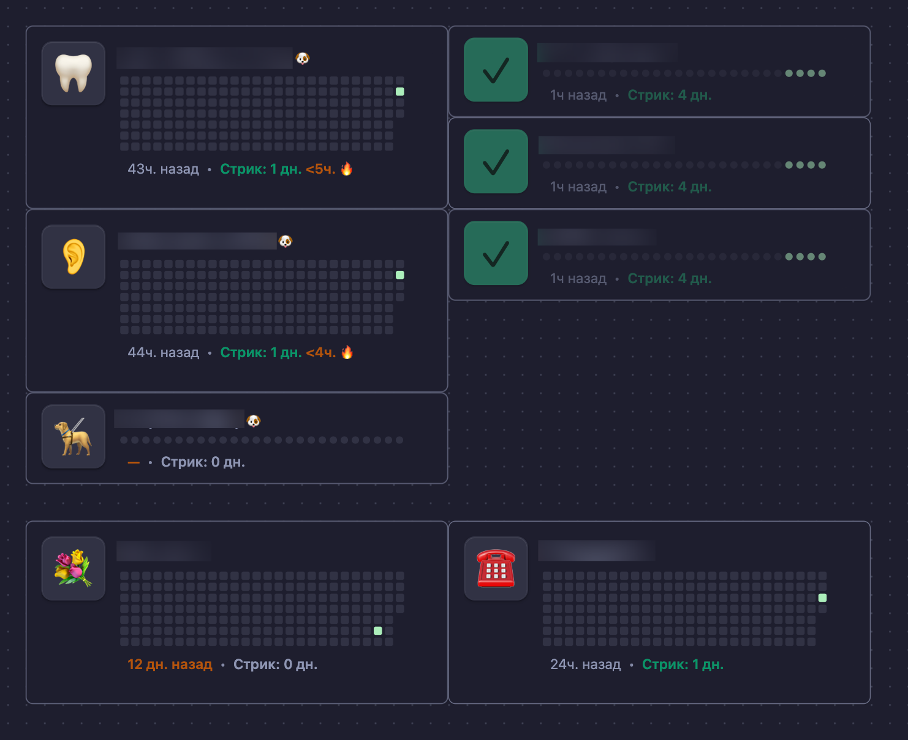

# Obsidian Habit Tracking — habit-button.js

A tiny DataviewJS widget for Obsidian: a habit card with a one‑click button, streak counter, and heatmap (grid/row). On click, it appends a line to the daily note and updates the visualization.



## Requirements

- Obsidian (the script uses `app.vault` and `Notice`).
- Dataview plugin enabled.

## Installation

1. Copy `habit-button.js` into your vault. Recommended path: `meta/dv/habit-button.js`.
2. Insert a DataviewJS code block in the target note and call the view:

```dataviewjs
await dv.view("meta/dv/habit-button", {
  title: "Creatine",
  warnHoursThreshold: 16,
  icon: "💪",
  heatLayout: "row",   // "grid" or "row"
  days: 26              // for row; for grid use weeks
});
```

The path in `dv.view("…")` should point to the file without the `.js` extension, relative to the vault root.

## What it does

- On click, writes a line to today’s daily file: `- #habit_<key> HH:MM`.
- By default, daily files are looked up/created in the `daily` folder as `YYYY-MM-DD.md`.
- The habit key is derived from `title`: lowercased, spaces → `_`, non‑letter/digit/underscore removed, consecutive underscores collapsed.
- The streak is calculated by unique days with an allowed gap of `24h + warnHoursThreshold` (or 48h if the threshold is not set).
- Visualization: a heatmap by days (`row`) or by weeks (`grid`), with the newest days/weeks on the right.

## Parameters (input)

- `title` (string, required): habit title.
- `icon` (string, optional): emoji on the button (defaults to ✅).
- `warnHoursThreshold` (number, optional): hours without a mark before showing an “overdue” hint. Also affects streak survivability.
- `dailyFolder` (string, optional): folder for daily notes. Defaults to `"daily"`.
- Heatmap:
  - `heatLayout`: `"grid"` or `"row"` (defaults to `"grid"`).
  - For `grid`: `weeks` (number of weeks, defaults to 26).
  - For `row`: `days` (number of days, defaults to 240).
- Sizing (optional): `cellSize`, `cellGap` (for grid), `dotSize`, `dotGap` (for row).

## Examples

A card with a row heatmap and a 16h warning threshold:

```dataviewjs
await dv.view("meta/dv/habit-button", {
  title: "Creatine",
  warnHoursThreshold: 16,
  icon: "💪",
  heatLayout: "row",
  days: 26
});
```

A weekly grid without extra parameters (26 weeks by default):

```dataviewjs
await dv.view("meta/dv/habit-button", {
  title: "Walk the dog 🐶",
  warnHoursThreshold: 16,
  icon: "🦮",
  heatLayout: "grid"
});
```

A rarer habit with a larger threshold:

```dataviewjs
await dv.view("meta/dv/habit-button", {
  title: "Call mom",
  warnHoursThreshold: 24 * 6,
  icon: "☎️"
});
```

## Notes

- If today’s daily file doesn’t exist, it will be created automatically with the heading `# YYYY-MM-DD`.
- In `grid`, future days are visually hidden (transparent) — the current day remains visible.
- The “<Nh 🔥” hint appears when roughly less than a day remains before the streak would break.
- The script is intended to run inside Obsidian (DataviewJS); it won’t run standalone in a browser/Node.

## Repository structure

- `habit-button.js` — the widget itself.
- `README.md` — this description and examples.
