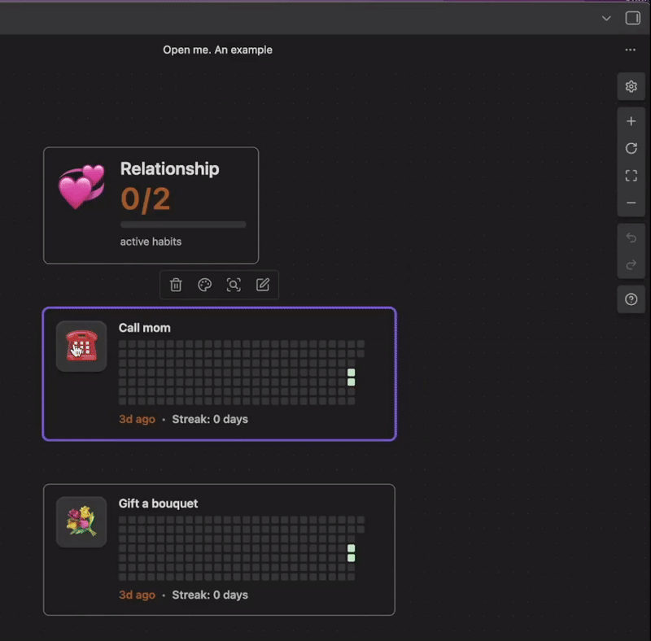

# Obsidian Habit Button

This plugin lets you track your habits in a single tap. Features like streaks and heatmaps will help you staying motivated, while grace and warning periods will allow you to stay flexible within your timeline.

You can drop in your habit buttons anywhere including Canvas. To not lose the focus on lots of habits, there are groups that provide a quick status.

## Demo

### Habit Button

- render a tap-to-log habit card with streak, heatmap, and overdue hints
- supports per-block icons, grace periods, and granular layouts



### Habit Group

- aggregate multiple habits into a summarized status bar
- highlight streak health with ordered emerald/amber/gray segments


### Canvas Mashup

- mix and match buttons and groups on an Obsidian Canvas for quick daily reviews

[Habit canvas editing.mp4](assets/canvas-mashup-demo.mp4)

### Settings

- change the default behavior of the buttons and groups
- change the language

[Settings overview.mp4](assets/settings-overview.mp4)

### Your daily notes

All the habit information is stored in your daily notes


## Installation

To use the plugin simply install it from the Obsidian marketplace.

## Usage

There are commands which you can invoke to paste the ready blocks into your note


### Habit Button block

Use a fenced code block with language `habit-button` (please remove "\\" before `):

```markdown
\```habit-button
title: Morning Stretch
icon: ☀️
group: health
\```
```


### Habit Group block

Summarize related habits with a `habit-group` block:

```markdown
\```habit-group
title: My health
group: health
icon: ❤️
\```
```


Groups read live data from the habit registry. When you provide `habitsLocations`, the block eagerly rescans those notes on each render; without it, the group relies on cached registry updates from embedded habit buttons.

### Canvas placement

Drag the rendered blocks onto a Canvas or embed them via copy/paste. The plugin keeps stats in sync, so the Canvas view updates automatically when you mark a habit done elsewhere.


## Features

- **One-tap logging with history-aware streaks** — click the button to append a timestamped entry, update the streak, and repaint the heatmap instantly.

- **Adaptive warnings and styled progress** — warning windows render amber striped segments, while active habits stay emerald and inactive habits gray.

- **Habit groups with progress bar** — see emerald (healthy), amber (warning), and gray (stalled) habits aligned in a single progress bar and aggregate counter.

- **Canvas-ready layout** — combine multiple cards and groups into dashboards, drag them around, and keep everything synchronized with your vault data.

## Known Issues

- The cards are not up to date if the notes were updated in the background. To refresh the cards, reopen the note or the canvas (you can switch to a different note and back)
